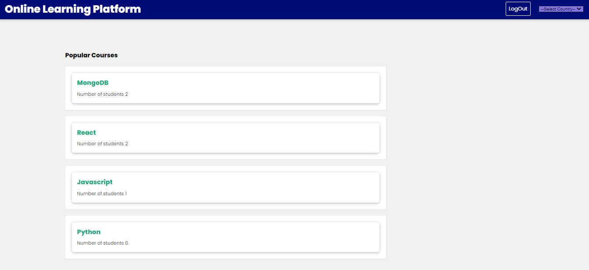
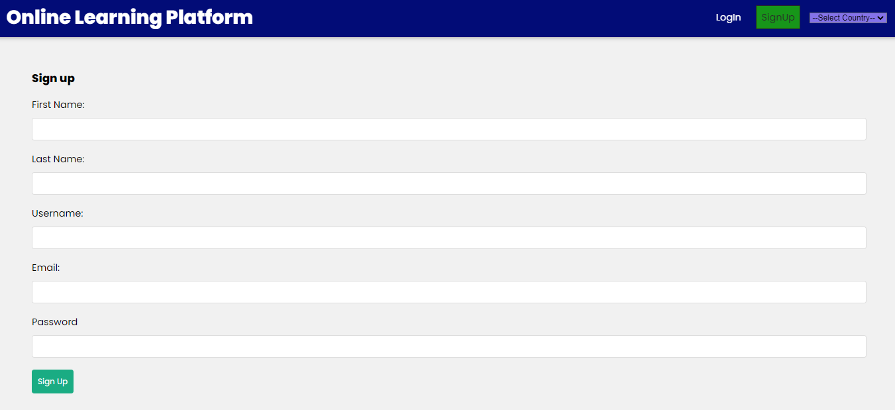
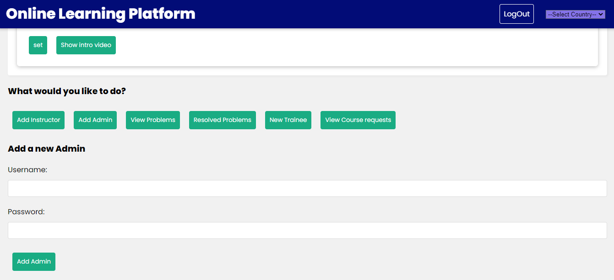
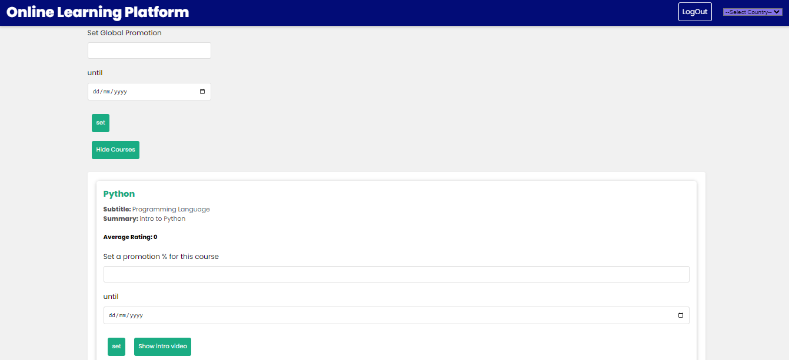
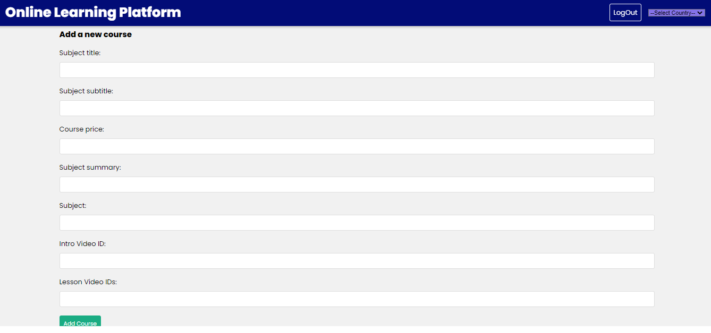
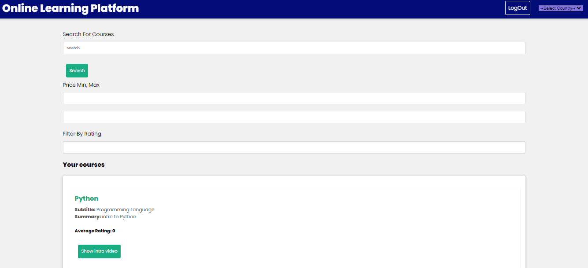
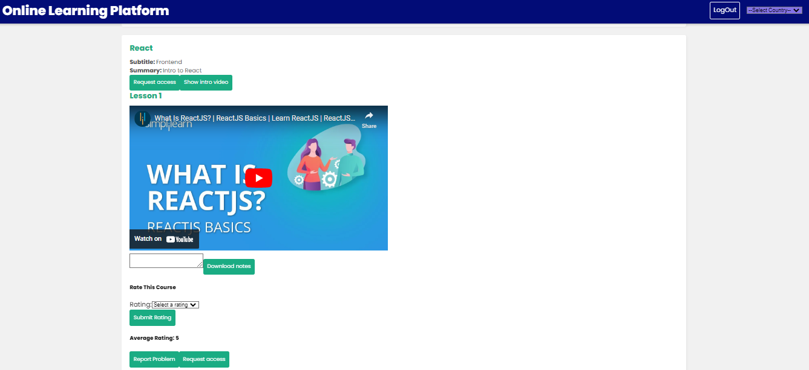
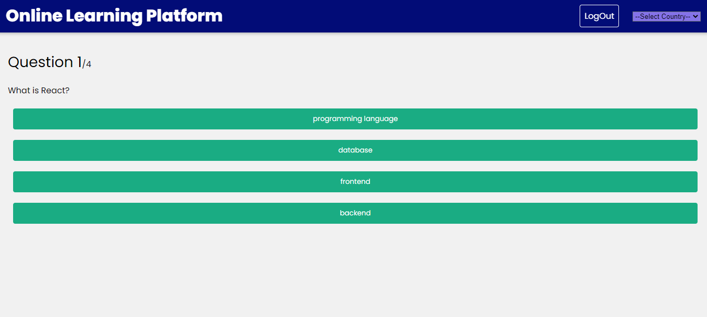
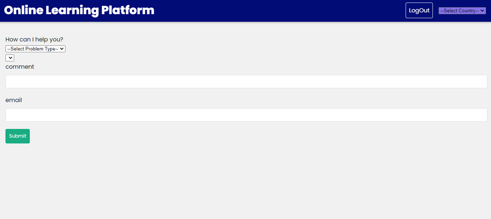

# Online Learning Platform - An Online Learning Platform

## Motivation

Online Learning Platform is a university project for CSEN704 - Advanced Computer Lab course @ GUC, the main purpose of the project was to build a complete Online learning environment through which users can register for courses and start learning content that will help them both academically and in their professional lives.

## Build Status

Currently Online Learning Platform is a Minimum Value Product (MVP), which can be used by customers and let us observe how they interact with the system.

## Some Screenshots from the website

1. Landing page
   ()
2. Sign Up form
   ()
3. Admin 
   ()
4. Admin set promotion
   ()
5. Instructor add course
   
6. Student Courses
   
   
7. Take a Quiz
   
8. Report an issue
   

## Technology used

This web application was build with MERN stack:

- MongoDB as our NoSQL database
- ExpressJS as our NodeJS wrapper
- ReactJS for our view library
- NodeJS for server-side JS runtime enviroment

Additional libraries used:

- Axios - promise-based http client
- Youtube-React a react Youtube Client
- bcryptjs
- mongoose - Object Document Mapper (ODM) of choice
- Material UI
- Bootstrap

## Features

- Visually appealing UI that helps the user enjoy his time browsing the website
- UX designed to guide the user smoothly throughout the website with recovery from error, reversibility and learnability
- Responsive design which gives the user feedback about what is currently happening

## Installation

- Make sure you have [NodeJS](https://nodejs.org/en/) installed on your machine

  You can check by running

         node -v

  in your terminal to make sure NodeJS is setup correctly

- Make sure to include two .env files in both the frontend and backend directories

### How to run the frontend:

1.  In your terminal navigate to

         /Sprint 1/frontend

2.  Install required packages by running

         Npm install

3.  Spin up the development server using

          npm start

    open your browser at http://localhost:3000

### How to run the backend:

1.  In your terminal navigate to

         /Sprint 1/backend

2.  Install nodemon by running

         npm i -g nodemon

3.  Install required packages by running

         npm install

4.  Spin up the development server using

          nodemon server

    It will run on http://localhost:4000

## API reference

### auth

1.  /studentsignup (POST)

    Request body (json)

         {
            "FirstName": "string",
            "Lastname": "string",
            "Email": "string",
            "Username": "string",
            "Password": "string",
         }

2.  /studentlogin (POST)

    Request body (json)

         {
            "email": "string",
            "password": "string",
         }

### Courses

3.  /viewcourses (GET)

    Request body (json)

         {
            "Title": "string",
            "Subtitle": "string",
            "Price": "integer",
            "Summary": "string",
            "Instructor": "String"
            "VideoID": "String"
            "LessonVideoIDs": "String"
         }

4.  /popularcourses (POST)

    Request body (json)

         {
            "Title": "string",
            "Subtitle": "string",
            "Price": "integer",
            "Summary": "string",
            "Instructor": "String"
            "VideoID": "String"
            "LessonVideoIDs": "String"
         }

5.  /registered-courses (GET)

    Request body (json)

         {
            "Title": "string",
            "Subtitle": "string",
            "Price": "integer",
            "Summary": "string",
            "Instructor": "String"
            "VideoID": "String"
            "LessonVideoIDs": "String"
         }

6.  /:id (GET)

    Request body (json)

         {
            "Title": "string",
            "Subtitle": "string",
            "Price": "integer",
            "Summary": "string",
            "Instructor": "String"
            "VideoID": "String"
            "LessonVideoIDs": "String"
         }

## Admin

7.  /problems (POST)

    Request body (json)

         {
            "Problem": "string",
            "CourseName": "string",
         }

8.  /mark-problem-as-resolved (POST)

         Request body (json)
         {
            "Problem": "string",
            "CourseName": "string",
         }

## Students

9.  /register-for-course (POST)

    Request body (json)

         {
            "Email": "string",
            "Course._id": "string",
         }

10. /registered-courses (POST)

    Request body (json)

         {
            "Title": "string",
            "Subtitle": "string",
            "Price": "integer",
            "Summary": "string",
            "Instructor": "String"
            "VideoID": "String"
            "LessonVideoIDs": "String"
         }

### /instructor

11. /CreateCourse (POST)

    Request body (json)

         {
            "Title": "string",
            "Subtitle": "string",
            "Price": "integer",
            "Summary": "string",
            "Instructor": "String"
            "VideoID": "String"
            "LessonVideoIDs": "String"
         }

### Trainee

12. /request-access/:courseId (GET)

         {
            "TraineeId": "string",
            "CourseID": "string"
         }

### /exercise

13. /createExercise (POST)

   Request body (json)

         {
            "creator",
            "title",
            "questoin1text",
            "question1answer",
            "question2text",
            "question2answer",
            "question3text",
            "question3answer",
            "question4text",
            "question4answer",
         }

14. /instexercises/:instid (GET)

   Request body (json)

         {
            "creator",
            "title",
            "questoin1text",
            "question1answer",
            "question2text",
            "question2answer",
            "question3text",
            "question3answer",
            "question4text",
            "question4answer",
         }

15. /:id (PATCH)

   Request body (json)

               {
                  "creator",
                  "title",
                  "questoin1text",
                  "question1answer",
                  "question2text",
                  "question2answer",
                  "question3text",
                  "question3answer",
                  "question4text",
                  "question4answer",
               }

16. /:id (DELETE)

17. /promotion (PUT)

   Request body (json)

            {
               "cid":"String"
               "oldPrice":"Number"
               "discount":"Number",
               "until":"Number"
            }

18. /globalpromotion (PUT)

   Request body (json)

            {
               "discount":"Number",
               "until":"Number"
            }

## Tests

- Postman can be used to test the functionality of different API endpoints make sure to attach bearer token if endpoint requires token

- Any browser can be used to test the functionality of the frontend webpages and web compenents and the integration with the

## How to use

### What can you do on the portal

- Go to admin dashboard if signed in as an admin:
   - View all courses
   - add admin/instructor/corporate trainee to the system 
   - view all problems reported by students
   - mark problems as resolved
   - view course requests

- Go to instructor dashboard if signed in as an instructor:
   - View all courses
   - Create a course
   - View all exercises
   - Create an exercise

- Go to student dashboard if signed in as a student:
   - View all registered courses
   - View course details
   - Register for a course
   - report a problem
 

## Contribute

Pull requests are more than welcomed in this repository, feel free to open one to fix a bug, enhance a feature or introduce a new one.

## Credits

Adham Ahmed

Mohamed Walid

Alaaeldin Abdelaziz

Mostafa Yours

Heejin
